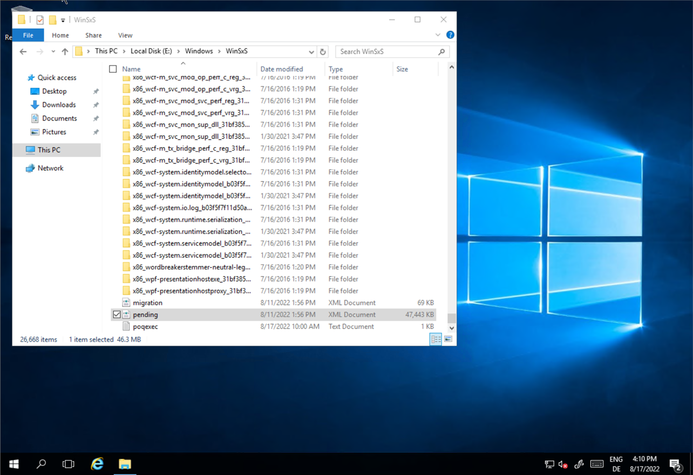

# How to fix Error C0000034 - Azure Windows VM doesn't start

Sometimes it might happen the Azure Windows VM doesn't start because of the error C0000034.

## How to discover the error
The **Boot diagnostics** of the affected VM will show the error in the Screenshot:

## How to fix the error
- You need a Azure Windows VM where the OS Disk could be attached as a Data Disk (for instance Repair01)
- Make notes of the configuration of the affected VM, for instance:
  - NIC and IP configuration
  - Disk configuration
- Delete the affected VM **but keep the OS-Disks and exiting Data Disks!**
- Attach the OS Disk to a Azure Windows VM, for instance *Repair01*, as a Data Disk

- Start the Repair01 VM and login
- In the Explorer navigate on the attached Disk, for instance Drive E:, to *E:\Windows\WinSxS*

- Modify the permission of *E:\Windows\WinSxS\pending.xml*
  - The user needs the permission to modify *the pending.xml*
- Create a copy of the *the pending.xml* as a backup
- Open the *pending.xml* in an editor (Notepad or Notepad++) - Loading might last a little bit because of the file size ;-)
- In the file search for *0000000000000000.cdf-ms* (using Strg+F in the editor)
- Delete the following lines:
  - *\<Checkpoint/\>*
  - *\<DeleteFile path=”SystemRootWinSxSFileMaps_0000000000000000.cdf-ms”\>*
  - If exists: *\<MoveFile source=”SystemRootWinSxSTempPendingRenamese56db1db48d4cb0199440000b01de419._0000000000000000.cdf-ms” destination=”SystemRootWinSxSFileMa_0000000000000000.cdf-ms”/\>*
-  Save the file modified *pending.xml*

- Detach the OS Disk from the VM Repair01

- Create a new VM with the same name of the affected VM
  - In the Azure Portal Navigate to **Disks**
  - Find and select the modified OS Disk
  - Choose *Create VM* and follow the steps in the wizard

## The result
The new created VM should now start without the error.
You could verify the result in the **Boot diagnostics** of the affected VM 

