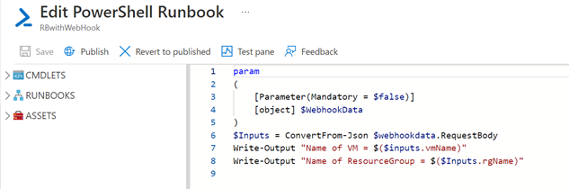
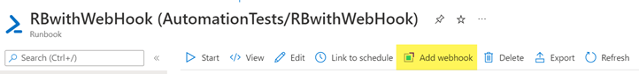
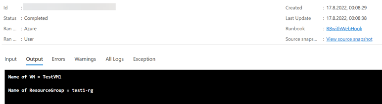

# How to start a Azure Automation via PowerShell - Invoke-Webrequest with parameters
### Create a Azure Automation Runboook
- Create an Azure Automation Runbook (PowerShell)
- Copy the content of *RunbookPowerShellScript.ps1* in the Editor -> Save -> Publish

- Add a Webhook to the Automation Runbook and save the URI/URL!

###
- Open the *Invoke-Webrequest_AutomationRunbook.ps1* on your computer
- Replace *\<your-webhook-URI\>* with the URI of the created Webhook
- Start the Powershell script

### Output

